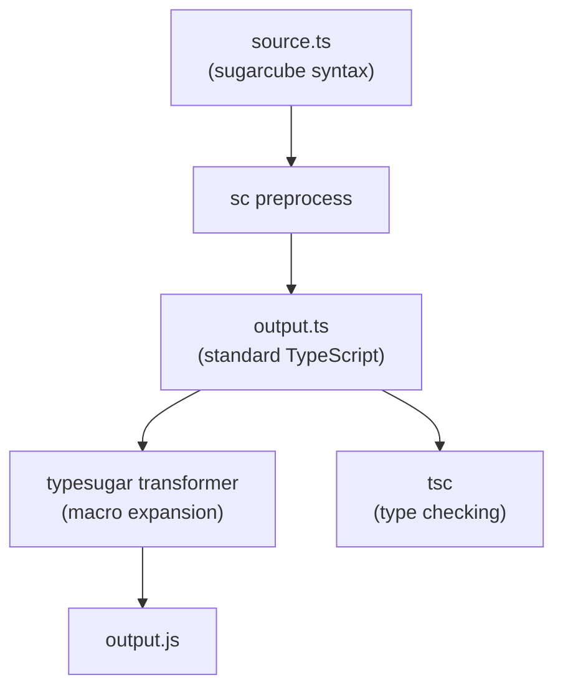

# sugarcube

A TypeScript preprocessor that adds custom syntax for the [typesugar](https://github.com/typesugar/typesugar) macro system. Written in Rust on top of [SWC](https://swc.rs/).

## What It Does

sugarcube extends TypeScript with three syntax forms, then compiles them away into standard TypeScript that `tsc` and typesugar can process.

**Input** — sugarcube syntax:

```typescript
interface Functor<F<_>> {
  map: <A, B>(fa: F<A>, f: (a: A) => B) => F<B>;
}

const result = data |> parse |> validate;
const list = 1 :: 2 :: 3 :: [];
```

**Output** — standard TypeScript (after `sc preprocess`):

```typescript
interface Functor<F> {
  map: <A, B>(fa: $<F, A>, f: (a: A) => B) => $<F, B>;
}

const result = __binop__(__binop__(data, "|>", parse), "|>", validate);
const list = __binop__(1, "::", __binop__(2, "::", __binop__(3, "::", [])));
```

### Where It Fits



## Installation

```bash
git clone https://github.com/typesugar/sugarcube.git
cd sugarcube
cargo install --path crates/sc_cli
```

## Quick Start

```bash
# Write some sugarcube-flavoured TypeScript
cat > example.ts << 'EOF'
const result = [1, 2, 3] |> map(x => x * 2) |> filter(x => x > 2);
const list = "a" :: "b" :: "c" :: [];
EOF

# Preprocess to standard TypeScript
sc preprocess example.ts

# Check syntax without emitting output
sc check example.ts

# Dump the AST as JSON (for debugging)
sc parse example.ts --ast
```

## CLI Reference

| Command | Description | Flags |
| --- | --- | --- |
| `sc preprocess <file>` | Parse, desugar, and emit standard TypeScript | `-o <output>`, `--source-map`, `--tsx` |
| `sc check <file>` | Parse and report syntax errors | `--tsx` |
| `sc parse <file>` | Parse and dump the AST | `--ast` (JSON output), `--tsx` |

All commands accept `.ts` and `.tsx` files. The `--tsx` flag enables JSX parsing explicitly; it's also inferred from the `.tsx` extension.

## Syntax Extensions

### Pipeline Operator (`|>`)

Chains values through functions left-to-right.

**Grammar:** `expr |> expr` — precedence 1 (lowest of sugarcube ops), left-associative.

**Desugaring:** `a |> f` → `__binop__(a, "|>", f)`

```typescript
// Single step
const parsed = rawData |> parseJSON;
// → __binop__(rawData, "|>", parseJSON)

// Chained — left-to-right
const result = data |> parse |> validate |> transform;
// → __binop__(__binop__(__binop__(data, "|>", parse), "|>", validate), "|>", transform)

// Mixed with cons — :: binds tighter
const x = a :: b |> f;
// → __binop__(__binop__(a, "::", b), "|>", f)
```

**Edge cases:**
- `|>` inside strings and comments is not rewritten
- `|>` in type annotations / interfaces is not rewritten
- `|` followed by `>` with a space between is two separate tokens (bitwise OR, then greater-than), not a pipeline

### Cons Operator (`::`)

Prepends an element to a list, ML-style.

**Grammar:** `expr :: expr` — precedence 5, right-associative.

**Desugaring:** `a :: b` → `__binop__(a, "::", b)`

```typescript
// Single cons
const pair = 1 :: [];
// → __binop__(1, "::", [])

// Right-associative chaining — builds from the tail
const list = 1 :: 2 :: 3 :: [];
// → __binop__(1, "::", __binop__(2, "::", __binop__(3, "::", [])))

// With expressions
const xs = head :: tail;
// → __binop__(head, "::", tail)
```

**Edge cases:**
- `:` `:` with a space between stays as two colons (e.g. type annotations like `x: :foo`)
- `::` inside type aliases and interfaces is not rewritten
- `::` binds tighter than `|>` — use parens to override

### Higher-Kinded Type Parameters (`F<_>`)

Declares type parameters as higher-kinded, then rewrites usages to the `$` type operator.

**Grammar:**
- Declaration: `<F<_>>` in a type parameter list (underscore placeholder)
- Usage: `F<A>` anywhere in the declaring scope → `$<F, A>`

**Desugaring:**
- `F<_>` in declaration → stripped to `F`
- `F<A>` in scope → `$<F, A>`

```typescript
// Declaration + usage
interface Functor<F<_>> {
  map: <A, B>(fa: F<A>, f: (a: A) => B) => F<B>;
}
// → interface Functor<F> {
// →   map: <A, B>(fa: $<F, A>, f: (a: A) => B) => $<F, B>;
// → }

// Multiple HKT params
type Transform<F<_>, G<_>> = <A>(fa: F<A>) => G<A>;
// → type Transform<F, G> = <A>(fa: $<F, A>) => $<G, A>;
```

**Edge cases:**
- `F<A>` outside the declaring scope is not rewritten
- Only uppercase identifiers followed by `<_>` are treated as HKT declarations
- Nested scopes use the innermost matching declaration

## Configuration

Syntax extensions are controlled by `ScSyntax` feature flags. All are enabled by default:

```rust
ScSyntax {
    pipeline: true,  // |> operator
    cons: true,      // :: operator
    hkt: true,       // F<_> type parameters
}
```

Disable individual extensions to avoid conflicts with other tooling or syntax you don't use.

## Integration with typesugar

sugarcube is the first stage of the typesugar compilation pipeline. The typical setup:

1. **sugarcube** preprocesses `.ts` files — rewrites `|>`, `::`, `F<_>` to standard TS
2. **typesugar transformer** (via ts-patch) expands macros like `__binop__` and `$<F, A>`
3. **tsc** type-checks and emits JavaScript

When using `unplugin-typesugar`, sugarcube runs automatically before the transformer. See the [typesugar docs](https://github.com/typesugar/typesugar) for build tool integration.

## Development

### Project Structure

```
crates/
  sc_ast/       Extended AST types (ScBinExpr, HktTypeParam, ScSyntax)
  sc_lexer/     Token merging (| + > → |>, : + : → ::)
  sc_parser/    Text-level preprocessor + SWC parser wrapper
  sc_desugar/   AST rewriting (pipeline, cons, HKT transforms)
  sc_cli/       CLI binary (sc)
  sc_test/      Test utilities
```

### Build

```bash
cargo build                       # all crates
cargo build -p sc_cli             # just the CLI
cargo install --path crates/sc_cli  # install locally
```

### Test

```bash
cargo test                        # all tests
cargo test -p sc_parser           # single crate
SC_UPDATE_FIXTURES=1 cargo test   # update golden files
```

### Lint

```bash
cargo clippy --all-targets
cargo fmt --check
```

## License

[Apache-2.0](LICENSE)
